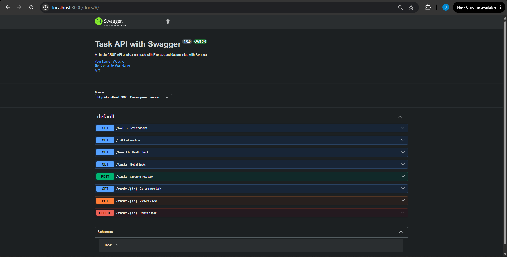

# Task API

A simple RESTful CRUD API for managing tasks, built using **Node.js**, **Express.js**, and documented with **Swagger UI**.

## 📋 Overview

Task API is a lightweight backend application that demonstrates a complete CRUD (Create, Read, Update, Delete) system using Express.js.

This project was developed as a learning project to practice:

- Building RESTful APIs
- Handling HTTP methods and status codes
- Creating API documentation using Swagger
- Structuring backend applications with Express.js
- Working with JSON-based request and response handling

## ✨ Features

- ✅ Complete CRUD operations for tasks
- ✅ RESTful API architecture
- ✅ Interactive Swagger UI documentation
- ✅ JSON request and response format
- ✅ Proper HTTP status codes
- ✅ In-memory data storage (no database required)

---

# 🚀 Getting Started

## Prerequisites

Before running the project, make sure you have installed:

- Node.js (v14 or higher)
- npm (included with Node.js)

Check your installed versions:

```bash
node -v
npm -v
```

---

# 📥 Installation

Clone the repository:

```bash
git clone https://github.com/jjanahassan/CRUD.git
```

Navigate to the project folder:

```bash
cd CRUDAPI-node
```

Install dependencies:

```bash
npm install
```

---

# ▶️ Running the Server

Start the application:

```bash
node server.js
```

The server will run on:

```
http://localhost:3000
```

You should see:

```
Server running on http://localhost:3000
Swagger UI available at http://localhost:3000/docs
```

---

# 📚 Swagger API Documentation

Swagger UI provides an interactive interface for testing all API endpoints.

Open your browser and visit:

```
http://localhost:3000/docs
```

You can test requests directly using the **"Try it out"** button.

---

# 🔗 API Endpoints

| Method | Endpoint | Description |
|--------|----------|-------------|
| GET | `/` | Returns API information |
| GET | `/hello` | Test endpoint |
| GET | `/health` | Checks API status |
| GET | `/tasks` | Retrieves all tasks |
| GET | `/tasks/:id` | Retrieves a task by ID |
| POST | `/tasks` | Creates a new task |
| PUT | `/tasks/:id` | Updates an existing task |
| DELETE | `/tasks/:id` | Deletes a task |

---

# 📦 Task Schema

A task object follows this structure:

```json
{
  "id": 1,
  "title": "Complete backend documentation",
  "done": false
}
```

| Field | Type | Description |
|------|------|-------------|
| id | Integer | Unique identifier generated automatically |
| title | String | Task description (required) |
| done | Boolean | Task completion status |

---

# 🔧 API Usage Examples

## Create a Task

### Request

```bash
curl -X POST http://localhost:3000/tasks \
-H "Content-Type: application/json" \
-d '{"title":"Learn Swagger"}'
```

### Response

```json
{
  "id": 4,
  "title": "Learn Swagger",
  "done": false
}
```

**Status Code:** `201 Created`

---

## Get All Tasks

### Request

```bash
curl http://localhost:3000/tasks
```

### Response

```json
[
  {
    "id": 1,
    "title": "Complete backend documentation",
    "done": false
  },
  {
    "id": 2,
    "title": "Test API endpoints",
    "done": true
  }
]
```

**Status Code:** `200 OK`

---

## Get Task By ID

### Request

```bash
curl http://localhost:3000/tasks/1
```

### Response

```json
{
  "id": 1,
  "title": "Complete backend documentation",
  "done": false
}
```

**Status Code:** `200 OK`

If the task does not exist:

```json
{
  "error": "Task 999 not found"
}
```

**Status Code:** `404 Not Found`

---

## Update a Task

### Request

```bash
curl -X PUT http://localhost:3000/tasks/1 \
-H "Content-Type: application/json" \
-d '{"title":"Updated task","done":true}'
```

### Response

```json
{
  "id": 1,
  "title": "Updated task",
  "done": true
}
```

**Status Code:** `200 OK`

---

## Delete a Task

### Request

```bash
curl -X DELETE http://localhost:3000/tasks/1
```

Response:

```
No Content
```

**Status Code:** `204 No Content`

---

# 🧪 CRUD Testing Flow

A complete CRUD cycle can be tested as follows:

```bash
# 1. Create a task
POST /tasks

# 2. Retrieve all tasks
GET /tasks

# 3. Update a task
PUT /tasks/:id

# 4. Retrieve the updated task
GET /tasks/:id

# 5. Delete the task
DELETE /tasks/:id

# 6. Confirm deletion
GET /tasks
```

---
# 📸 Swagger UI Preview



# 🛠️ Technology Stack

| Technology | Purpose |
|-----------|---------|
| Node.js | JavaScript runtime |
| Express.js | Backend web framework |
| Swagger UI Express | Interactive API documentation |
| Swagger JSDoc | Generates OpenAPI documentation |

---

# 📁 Project Structure

```
CRUDAPI-node/
│
├── server.js              # Main Express application
├── package.json           # Project dependencies
├── package-lock.json      # Dependency versions
├── README.md              # Project documentation
└── screenshots/           # Swagger screenshots
```

---

# 📊 HTTP Status Codes

| Status Code | Description |
|-------------|-------------|
| 200 OK | Request succeeded |
| 201 Created | Resource created successfully |
| 204 No Content | Request succeeded without response body |
| 400 Bad Request | Invalid input |
| 404 Not Found | Resource does not exist |

---

# 🚧 Future Improvements

Possible future enhancements:

- ☐ Add database integration (MongoDB/PostgreSQL)
- ☐ Add filtering and searching
- ☐ Add authentication and authorization
- ☐ Add environment variable configuration
- ☐ Add unit and integration tests
- ☐ Add request validation
- ☐ Add API rate limiting

---

# 👩‍💻 Author

**Jana Abdelwahab Hassan**

GitHub: [@jjanahassan](https://github.com/jjanahassan)

---

Built as part of a Backend Development Learning Journey 🚀
